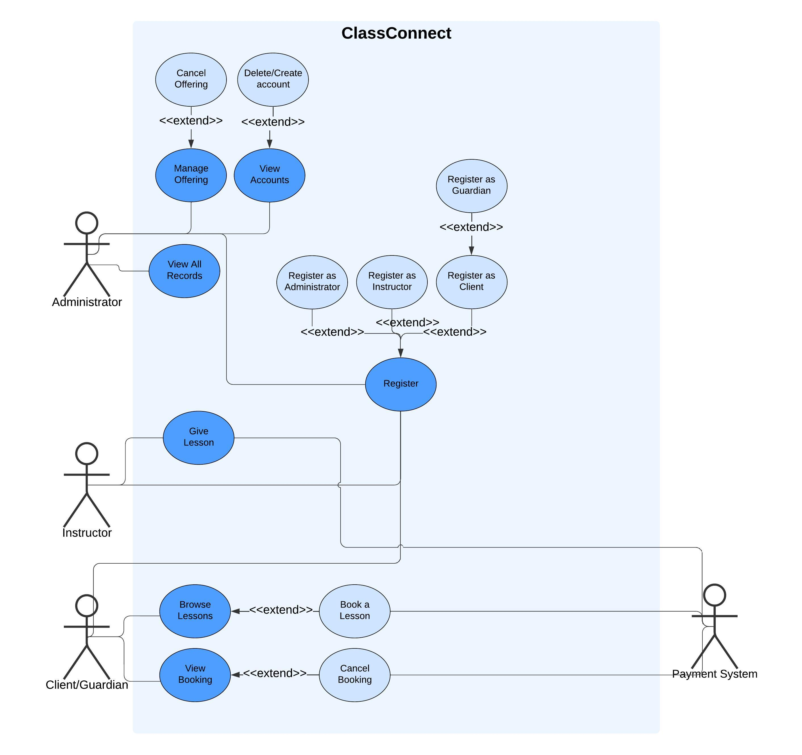

# 342 project: ClassConnect

## Introduction
**ClassConnect** is a scheduling and booking system designed to help organizations offer private and group lessons. It allows administrators to manage lesson offerings, instructors to register and accept available sessions, and clients to browse and book lessons. The system supports multiple lesson types, varying time slots, and allows legal guardians to manage bookings for underage clients.

## UML Use case diagram

## Technologies Used
- **Programming Language**: Java
- **Framework**: (TBD)
- **UML Tools**: Lucidchart
- **Version Control**: GitHub

## Team Members
- **Azmi Abidi**, ID: 40248132
- **Alimurat Dinchdonmez**, ID: 40245310
